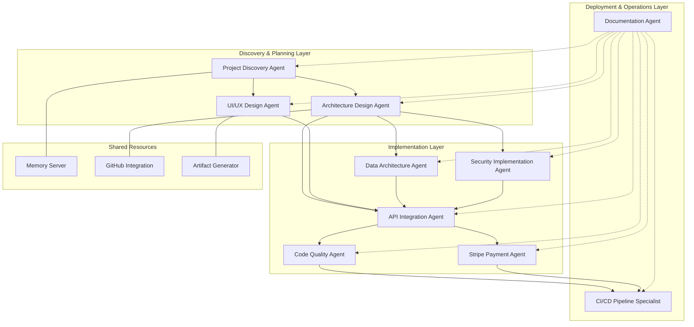

# Claude Code Architecture Framework
*A Comprehensive Sub-Agent System for Automated Software Development*

## Overview

This architecture framework transforms the traditional technical design baseline approach into an intelligent, automated development ecosystem using Claude Code and Model Context Protocol (MCP) integrations. The system consists of specialized AI agents that handle different aspects of software development, from initial discovery through deployment and maintenance.

## Core Architecture Principles

### 1. **Separation of Concerns**
Each agent specializes in a specific domain while maintaining clear interfaces for collaboration.

### 2. **MCP-First Integration**
All external system interactions flow through standardized MCP servers for consistency and reliability.

### 3. **Context Preservation**
Agents maintain project context through shared memory and documentation systems.

### 4. **Iterative Refinement**
Each agent can revisit and improve previous work as new information becomes available.

## Agent Architecture



## Quick Start

1. **Clone the repository**
```bash
git clone https://github.com/Chrisfoz/claude-code-architecture.git
cd claude-code-architecture
```

2. **Review the agent specifications** in `/docs/agents/`

3. **Configure your MCPs** using the examples in `/config/`

4. **Start with the Project Discovery Agent** for your existing projects

## Agent System Overview

### 🔍 Discovery & Planning Layer

| Agent | Purpose | Key MCPs |
|-------|---------|----------|
| **Project Discovery** | Analyze requirements, dependencies, integration points | `github`, `web_search`, `conversation_search`, `memory-server` |
| **Architecture Design** | Design logical and implementation components | `github`, `server-filesystem`, `repl`, `artifacts` |
| **UI/UX Design** | Interface design, user experience optimization | `puppeteer`, `github`, `artifacts`, `Hugging Face` |

### ⚙️ Implementation Layer

| Agent | Purpose | Key MCPs |
|-------|---------|----------|
| **Data Architecture** | Database design, API schemas, data flows | `mcp-server-supabase`, `github`, `artifacts`, `repl` |
| **Security Implementation** | Authentication, authorization, audit logging | `github`, `web_search`, `server-filesystem`, `artifacts` |
| **API Integration** | External system connections, message handling | `web_fetch`, `github`, `repl`, `artifacts` |
| **Code Quality** | Bug detection, standards enforcement, refactoring | `github`, `server-filesystem`, `repl`, `web_search` |
| **Stripe Payment** | Payment processing, fee optimization | `web_search`, `github`, `server-filesystem`, `repl` |

### 🚀 Deployment & Operations Layer

| Agent | Purpose | Key MCPs |
|-------|---------|----------|
| **CI/CD Pipeline Specialist** | Automated testing, deployment pipelines | `Vercel`, `github`, `server-filesystem`, `puppeteer` |
| **Documentation** | Comprehensive documentation generation | `conversation_search`, `github`, `artifacts`, `web_search` |

## MCP Integration Strategy

### Core MCP Stack
```yaml
required_mcps:
  - github              # Version control and repository management
  - server-filesystem   # Local file operations
  - artifacts          # Document and diagram generation
  - memory-server      # Context and knowledge management
  - web_search         # Research and discovery
  - repl               # Code analysis and validation

specialized_mcps:
  - puppeteer          # UI testing and automation
  - Vercel             # Deployment management
  - mcp-server-supabase # Database operations
  - conversation_search # Historical context
  - Hugging Face       # AI-powered generation
```

## Implementation Workflow

### Phase 1: Foundation Setup
1. **Project Discovery Agent** - Analyze existing codebase and requirements
2. **Architecture Design Agent** - Create high-level system design
3. **Documentation Agent** - Generate initial technical baseline

### Phase 2: Core Implementation
1. **Data Architecture Agent** - Design and implement data layer
2. **Security Implementation Agent** - Implement authentication and security
3. **API Integration Agent** - Build external system connections

### Phase 3: Specialized Features
1. **UI/UX Design Agent** - Implement user interface components
2. **Stripe Payment Agent** - Integrate payment processing
3. **Code Quality Agent** - Ensure code standards and quality

### Phase 4: Deployment & Operations
1. **CI/CD Pipeline Specialist** - Automate testing and deployment
2. **Documentation Agent** - Complete documentation suite
3. **All Agents** - Continuous monitoring and improvement

## Repository Structure

```
claude-code-architecture/
├── docs/
│   ├── architecture/           # System architecture documentation
│   ├── agents/                # Individual agent specifications
│   └── mcps/                  # MCP integration guides
├── src/
│   ├── agents/                # Agent implementation templates
│   ├── mcps/                  # MCP connector implementations
│   ├── core/                  # Shared core functionality
│   └── utils/                 # Utility functions and helpers
├── config/
│   ├── agents/                # Agent configuration examples
│   └── mcps/                  # MCP configuration templates
├── tests/
│   ├── unit/                  # Unit tests for agents
│   └── integration/           # Integration tests
├── examples/
│   ├── workflows/             # Example workflow implementations
│   └── projects/              # Sample project configurations
└── templates/
    ├── agents/                # Agent template files
    └── projects/              # Project template structures
```

## Getting Started with Agents

### Example: Project Discovery Agent Usage

```typescript
interface ProjectDiscoveryAgent {
  analyzeCodebase(repoUrl: string): ProjectContext
  identifyDependencies(): ExternalEntity[]
  mapIntegrationPoints(): IntegrationMap
  generateSystemContext(): SystemContextDiagram
}

// Usage example
const discovery = new ProjectDiscoveryAgent()
const context = await discovery.analyzeCodebase('https://github.com/user/project')
const integrations = await discovery.mapIntegrationPoints()
```

### Example: MCP Integration Pattern

```typescript
async function discoverProject(repoUrl: string) {
  const codebase = await github.analyzeRepository(repoUrl)
  const context = await conversation_search.findRelatedProjects()
  const knowledge = await memory_server.storeProjectContext({
    codebase,
    context,
    timestamp: new Date()
  })
  return knowledge
}
```

## Contributing

1. Fork the repository
2. Create a feature branch (`git checkout -b feature/amazing-agent`)
3. Commit your changes (`git commit -m 'Add amazing new agent'`)
4. Push to the branch (`git push origin feature/amazing-agent`)
5. Open a Pull Request

## Documentation

- [Architecture Overview](./docs/architecture/README.md)
- [Agent Specifications](./docs/agents/README.md)
- [MCP Integration Guide](./docs/mcps/README.md)
- [Configuration Examples](./config/README.md)

## License

MIT License - see [LICENSE](LICENSE) file for details.

## Roadmap

- [ ] Complete agent implementation templates
- [ ] Add comprehensive test suites
- [ ] Create interactive agent configuration tools
- [ ] Develop monitoring and analytics dashboard
- [ ] Add support for custom agent types
- [ ] Integrate with additional MCP servers

## Support

- Create an [Issue](https://github.com/Chrisfoz/claude-code-architecture/issues) for bug reports or feature requests
- Join discussions in [Discussions](https://github.com/Chrisfoz/claude-code-architecture/discussions)

---

*Built for the future of automated software development with Claude Code and MCP integrations.*